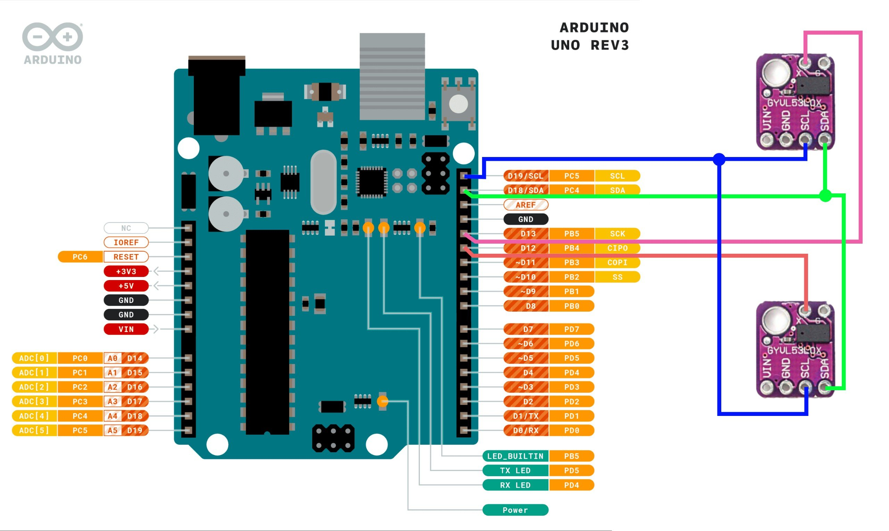

## Sử dụng nhiều module VL53L0X trên 1 kênh I2C với Arduino

### 1. Kết nối



- Cấp nguồn +5V và GND cho các module VL53L0X
- Chân SCL được nối với nhau và nối với SCL trên Arduino
- Chân SDA được nối với nhau và nối với SDA trên Arduino
- Chân X (XSHUT) được nối với các chân Digital trên Arduino để điều khiển bật tắt module VL53L0X

### 2. Cài đặt thư viện

- Cài đặt thư viện [Adafruit_VL53L0X](https://www.arduino.cc/reference/en/libraries/adafruit_vl53l0x/) cho Arduino

### 3. Nguyên lý hoạt động

- Module VL53L0X có chân XSHUT để điều khiển bật tắt module. Khi chân XSHUT được kéo xuống mức LOW thì module sẽ bị tắt nguồn. Khi chân XSHUT được kéo lên mức HIGH thì module sẽ được cấp nguồn.

- Để sử dụng được nhiều module thì ta cần định các địa chỉ I2C khác nhau cho chúng. Để làm điều này, ta sẽ sử dụng chân XSHUT để điều khiển bật tắt module. Mỗi khi module được tắt đi và bật lại thì nó sẽ về địa chỉ mặc định là `0x29`. Ta chỉ có thể đổi địa chỉ cho cùng lúc 1 module nên vì vậy các bước để đổi địa chỉ như sau:

1. Reset về địa chỉ mặc định bằng cách tắt nguồn module và bật lại rồi lại tắt tất cả module.
2. Lần lượt bật từng module lên và đổi địa chỉ cho từng module.
    - Địa chỉ được đặt phải khác địa chỉ mặc định
    - Địa chỉ của các module phải khác nhau

Như vậy ta có thể sử dụng nhiều module VL53L0X trên 1 kênh I2C với Arduino.

### 4. Giải thích code

1. Đặt các địa chỉ cho các module
```c++
#define LOX1_ADDRESS 0x30
#define LOX2_ADDRESS 0x31
```

2. Khải báo các chân XSHUT
```c++
#define SHT_LOX1 12
#define SHT_LOX2 13
```

3. Khởi tạo các biến
```c++
// Các biến quản lý các module
Adafruit_VL53L0X lox1 = Adafruit_VL53L0X();
Adafruit_VL53L0X lox2 = Adafruit_VL53L0X();

// Các biến lưu trữ giá trị của các cảm biến
VL53L0X_RangingMeasurementData_t measure1;
VL53L0X_RangingMeasurementData_t measure2;
```

4. Chỉnh sửa hàm `setID()` để phù hợp với số lượng module sử dụng

5. Khai báo OUTPUT cho các chân XSHUT, và gọi hàm `setID()` để đặt địa chỉ cho các module trong hàm `setup()`
```c++
void setup() {
    pinMode(SHT_LOX1, OUTPUT);
    pinMode(SHT_LOX2, OUTPUT);

    // Định địa chỉ cho cảm biến
    setID();
}
```

6. Trong hàm `loop()` đọc giá trị cảm biến
```c++
void loop() {
    // Đọc giá trị cảm biến
    lox1.rangingTest(&measure1, false);
    lox2.rangingTest(&measure2, false);

    // Lấy giá trị đo được dưới dạng mm
    uint16_t m1_val = measure1.RangeMilliMeter
    uint16_t m2_val = measure2.RangeMilliMeter
}
```